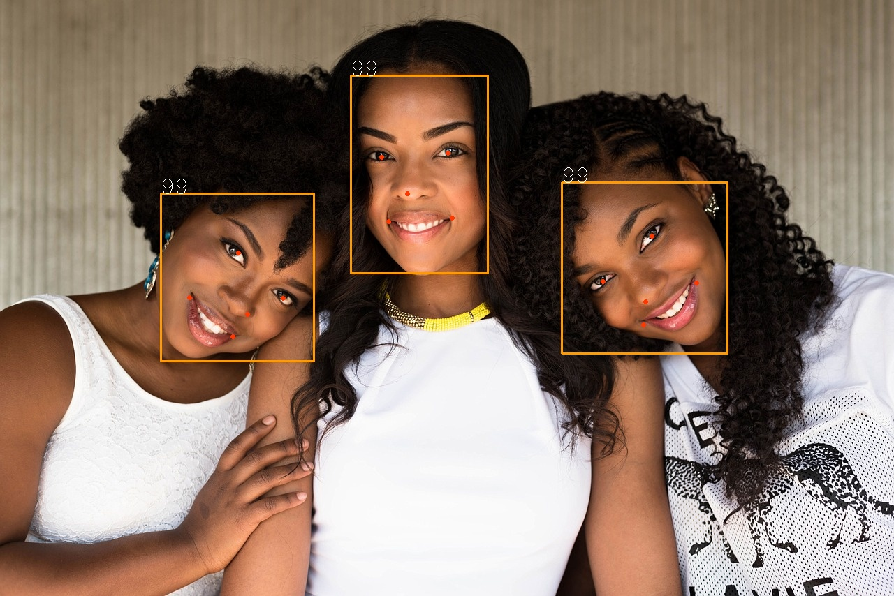

mtcnn-python
==============
+ Install
<code>
$ pip3 install mtcnn-python
</code>

+ Code
```
import cv2
from mtcnn import MTCNN

detector = MTCNN()

image = cv2.imread("input.jpg")
items = detector.detect_faces(cv2.cvtColor(image, cv2.COLOR_BGR2RGB))

for item in items:
  bounding_box = item['box']
  keypoints = item['keypoints']

  cv2.rectangle(image,
              (bounding_box[0], bounding_box[1]),
              (bounding_box[0]+bounding_box[2], bounding_box[1] + bounding_box[3]),
              (0,155,255),
              2)
  cv2.circle(image,(keypoints['left_eye']), 2, (0,55,255), 2)
  cv2.circle(image,(keypoints['right_eye']), 2, (0,55,255), 2)
  cv2.circle(image,(keypoints['nose']), 2, (0,55,255), 2)
  cv2.circle(image,(keypoints['mouth_left']), 2, (0,55,255), 2)
  cv2.circle(image,(keypoints['mouth_right']), 2, (0,55,255), 2)
  cv2.putText(image, f"{int(item['confidence']*100)}", (bounding_box[0], bounding_box[1]), cv2.FONT_HERSHEY_SIMPLEX, 1, (255, 255, 255))
cv2.imwrite("output.jpg", image)
print(items)
```

+ Result (free sample)


